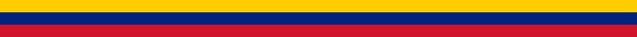

<p align="center">
  
</p>

<h1 align="center">VenGeoJSON</h1>

<p align="center">
  Capas geográficas de <strong>Venezuela</strong> en formato <a href="https://geojson.org/">GeoJSON</a> (RFC 7946),<br/>
  listas para mapas web, análisis espacial y aplicaciones que consuman datos vectoriales.
</p>

<p align="center">
  Sin dependencias ni compilación: archivos <code>.geojson</code> para servir de forma estática o importar en tu proyecto.
</p>

<p align="center">
  <strong>VenGeoJSON</strong> no es el SIG Geocadena ni forma parte del MPV/CENDITEL: es un repositorio <em>independiente</em> que republica y organiza capas GeoJSON tomadas de su fuente pública para facilitar el acceso (p. ej. Git, CDN, mapas web). Más detalle en <a href="#fuente-y-atribución">Fuente y atribución</a> y en <a href="#mantenimiento">Mantenimiento</a>.
</p>

## Ejemplo en vista

Vista previa de la capa [`venezuela.geojson`](venezuela.geojson) (entidades federales y zona en reclamación):

<p align="center">
  
</p>

<p align="center"><sub>Polígonos generados a partir de <code>venezuela.geojson</code> · WGS 84 · regenerar con <code>node scripts/generate-map-svg.mjs</code></sub></p>

## Contenido

| Archivo / carpeta | Descripción | Entidades |
|-------------------|-------------|-----------|
| [`venezuela.geojson`](venezuela.geojson) | División político-territorial nacional (estados, Distrito Capital y zona en reclamación) | 25 |
| [`Estados/`](Estados/) | Un archivo por entidad federal (`01.geojson` … `24.geojson`) | 24 |
| [`ciudades.geojson`](ciudades.geojson) | Polígonos de localidades / áreas urbanas | 434 |
| [`carreterasDeVenezuela.geojson`](carreterasDeVenezuela.geojson) | Red vial (segmentos `LineString`) | 17 975 |

### Tamaño aproximado

| Archivo | Tamaño |
|---------|--------|
| `venezuela.geojson` | ~6,3 MB |
| `ciudades.geojson` | ~1,1 MB |
| `carreterasDeVenezuela.geojson` | ~12,9 MB |

Si publicas el repositorio en Git, conviene usar [Git LFS](https://git-lfs.com/) para los archivos grandes.

## Sistema de coordenadas

Todas las geometrías usan **WGS 84**: coordenadas en grados decimales **`[longitud, latitud]`** (orden GeoJSON estándar).

## Esquema de datos

### Estados (`venezuela.geojson` y `Estados/NN.geojson`)

Cada feature representa una entidad federal.

| Propiedad | Descripción |
|-----------|-------------|
| `COD_ESTADO` | Código de dos dígitos (`01`–`24`, más `00` en el archivo nacional) |
| `ESTADO` | Nombre en mayúsculas |

Geometrías: `Polygon` o `MultiPolygon` (por ejemplo Carabobo, Nueva Esparta, Zulia).

En `venezuela.geojson` aparece además la feature **`ZONA EN RECLAMACION`** (`COD_ESTADO`: `00`), correspondiente al área en disputa con Guyana (Esequibo). Esa entidad **no** tiene archivo propio en `Estados/`.

#### Códigos en `Estados/`

| Archivo | `COD_ESTADO` | Estado |
|---------|--------------|--------|
| `01.geojson` | 01 | Distrito Capital |
| `02.geojson` | 02 | Amazonas |
| `03.geojson` | 03 | Anzoátegui |
| `04.geojson` | 04 | Apure |
| `05.geojson` | 05 | Aragua |
| `06.geojson` | 06 | Barinas |
| `07.geojson` | 07 | Bolívar |
| `08.geojson` | 08 | Carabobo |
| `09.geojson` | 09 | Cojedes |
| `10.geojson` | 10 | Delta Amacuro |
| `11.geojson` | 11 | Falcón |
| `12.geojson` | 12 | Guárico |
| `13.geojson` | 13 | Lara |
| `14.geojson` | 14 | Mérida |
| `15.geojson` | 15 | Miranda |
| `16.geojson` | 16 | Monagas |
| `17.geojson` | 17 | Nueva Esparta |
| `18.geojson` | 18 | Portuguesa |
| `19.geojson` | 19 | Sucre |
| `20.geojson` | 20 | Táchira |
| `21.geojson` | 21 | Trujillo |
| `22.geojson` | 22 | Yaracuy |
| `23.geojson` | 23 | Zulia |
| `24.geojson` | 24 | Vargas |

### Ciudades (`ciudades.geojson`)

Polígonos de localidades.

| Propiedad | Descripción |
|-----------|-------------|
| `gid` | Identificador del registro |
| `nombre` | Nombre de la localidad |
| `codigo` | Código asociado (p. ej. división administrativa) |
| `superficie` | Superficie (unidad según fuente original) |
| `perimetro` | Perímetro (unidad según fuente original) |

### Carreteras (`carreterasDeVenezuela.geojson`)

Segmentos de vía como `LineString`.

| Propiedad | Descripción |
|-----------|-------------|
| `NOMBRE` | Nombre de la vía (puede estar vacío) |
| `CARRETERA` | Clasificación (p. ej. `ENGRANZONADA`, `TERCER ORDEN`, `SEGUNDO ORDEN`) |
| `TIPO` | Tipo de vía (p. ej. `E`, `D`, `C`, `U`) |
| `PAVIMENTO` | Pavimentación (`SI`, `NO` o vacío) |
| `OBSERVACIO` | Observaciones |

## Uso rápido

### Cargar en el navegador (fetch)

```javascript
const response = await fetch("/venezuela.geojson");
const geojson = await response.json();
```

Sirve los archivos desde tu servidor web o CDN con el tipo MIME `application/geo+json` (o `application/json`).

### Leaflet

```javascript
import L from "leaflet";

const map = L.map("map").setView([8.0, -66.0], 6);

L.tileLayer("https://{s}.tile.openstreetmap.org/{z}/{x}/{y}.png", {
  attribution: "&copy; OpenStreetMap",
}).addTo(map);

const states = await fetch("venezuela.geojson").then((r) => r.json());

L.geoJSON(states, {
  style: { color: "#3388ff", weight: 1, fillOpacity: 0.2 },
  onEachFeature: (feature, layer) => {
    layer.bindPopup(feature.properties.ESTADO);
  },
}).addTo(map);
```

### Mapbox GL JS / MapLibre GL

Añade una fuente `geojson` y una capa `fill` o `line` apuntando a la URL del archivo (o incrusta el GeoJSON en el estilo si el tamaño lo permite).

### QGIS / GDAL

- **QGIS**: *Capa → Añadir capa → Añadir capa vectorial* y selecciona el `.geojson`.
- **ogr2ogr** (convertir a otro formato):

```bash
ogr2ogr -f GeoPackage venezuela.gpkg venezuela.geojson
```

### Filtrar un solo estado

Usa el archivo correspondiente en `Estados/` (por ejemplo `Estados/13.geojson` para Lara) en lugar de filtrar el GeoJSON nacional.

## Fuente y atribución

### Qué es (y qué no es) este repositorio

| | Descripción |
|---|---|
| **VenGeoJSON** (este repo) | Copia u organización de capas **GeoJSON** publicadas por el MPV/Geocadena, con enlaces a la fuente original, para facilitar en **Git/GitHub** (u otro hosting) la descarga y el uso en mapas y apps. **No incluye** el código ni los servicios del SIG Geocadena. La carpeta `Estados/` divide el archivo nacional en un GeoJSON por entidad (`01`–`24`). |
| **MPV / Geocadena / CENDITEL** | El [Observatorio Productivo Venezolano](http://mpv.cenditel.gob.ve/), el SIG **Geocadena**, el código del módulo Cadenas y los productos oficiales de [CENDITEL](https://www.cenditel.gob.ve/). **VenGeoJSON no es eso** y no hay afiliación, respaldo ni mantenimiento por parte de esas instituciones. |

En **VenGeoJSON**, los **datos** de los `.geojson` (geometrías y atributos) vienen de la fuente indicada abajo. Lo **propio de este repo** (README, carpeta `Estados/`, `scripts/`, `assets/`, etc.) es empaquetado y documentación de [**Ejeoxlac**](https://github.com/Ejeoxlac), mantenedor del repositorio, no del MPV.

### Origen de las capas

Las capas provienen del **Sistema de Información Geográfico (Geocadena)** del MPV, disponibles en el [índice de capas GeoJSON de Geocadena](https://mpv.cenditel.gob.ve/cadenas/browser/observatorio/procesos/apps/geocadena/media/geojson?rev=3f752f81c0f97fe4083947a5d432021bdf587bba&order=name). Para contexto del software institucional (no sustituye la fuente de datos): [wiki del módulo Cadenas](https://mpv.cenditel.gob.ve/cadenas/wiki).

| Capa en este repo | En Geocadena (MPV) |
|-------------------|-------------------|
| `venezuela.geojson`, `Estados/*.geojson` | División político-territorial estadal — p. ej. [`venezuela.geojson`](https://mpv.cenditel.gob.ve/cadenas/browser/observatorio/procesos/apps/geocadena/media/geojson/venezuela.geojson) |
| `ciudades.geojson`, `carreterasDeVenezuela.geojson` | Misma [carpeta de medios GeoJSON](https://mpv.cenditel.gob.ve/cadenas/browser/observatorio/procesos/apps/geocadena/media/geojson?rev=3f752f81c0f97fe4083947a5d432021bdf587bba&order=name); confirma el nombre del archivo en el índice (puede diferir del de este repo). |

**Atribución de los datos** (no de VenGeoJSON como proyecto CENDITEL): © Fundación CENDITEL — Observatorio Productivo Venezolano, módulo Geocadena.

### Licencia de los datos

Este repositorio es un **empaquetado de conveniencia** por terceros; no sustituye los términos del titular de los datos ni implica que CENDITEL avala esta copia. CENDITEL ha descrito el SIG del observatorio como desarrollo en **software libre**; eso no implica por sí solo que todas las capas GeoJSON puedan redistribuirse bajo una licencia tipo MIT. Antes de republicar los archivos o usarlos en productos comerciales, revisa las condiciones publicadas en MPV/CENDITEL o consulta al titular. Los metadatos de los `.geojson` no incluyen licencia explícita.

## Notas

- Los límites administrativos y la red vial pueden no coincidir con la cartografía oficial más reciente; verifica antes de usarlos en producción o en informes legales.
- Algunos nombres en `ciudades.geojson` pueden mostrar problemas de codificación de caracteres (UTF-8 mal interpretado en la fuente).
- Si redistribuyes las capas, mantén la atribución de la sección [Fuente y atribución](#fuente-y-atribución) y los términos que correspondan al MPV/CENDITEL.

## Estructura del proyecto

```
VenGeoJSON/
├── README.md
├── assets/
│   ├── bandera-venezuela.svg
│   └── mapa-venezuela-estados.svg
├── scripts/
│   └── generate-map-svg.mjs
├── venezuela.geojson
├── ciudades.geojson
├── carreterasDeVenezuela.geojson
└── Estados/
    ├── 01.geojson
    ├── …
    └── 24.geojson
```

## Contribuciones

Las mejoras bienvenidas incluyen: simplificación de geometrías para web, corrección de topología, normalización de nombres, metadatos de fuente y licencia, y versiones ligeras (TopoJSON o archivos por estado para carreteras).

## Mantenimiento

**VenGeoJSON** es un proyecto personal de [**Ejeoxlac**](https://github.com/ejeoxlac) (Bill Anthony Niño Riera): empaqueta y documenta capas GeoJSON de la fuente MPV/Geocadena para facilitar su distribución. **No** representa a CENDITEL ni al Observatorio Productivo Venezolano.
